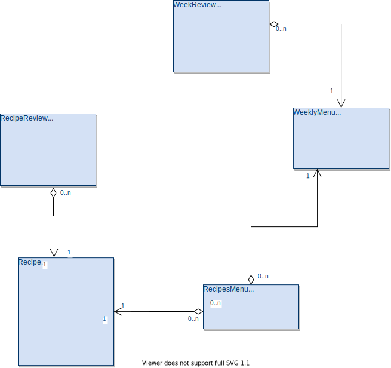

# Solution Design

## Database 

## Endpoints

- /recipes
    - POST: Create a new recipe. 
    - GET: Read all the recipes, no pagination implemented. 
    - /{recipeID}
        - PUT: Update an existing recipe.
        - DELETE: Delete an existing recipe. It will remove the link with weeklyMenu whether it exists.

- /weeklyMenus 
    - GET: Read all the weeklyMenus, no pagination implemented.
    - POST: Create a new weeklyMenu
    - /{weeklyMenuID}
        - PUT: Update an existing weeklyMenu.
        - DELETE: Delete an existing weeklyMenu. It will remove the link with all the recipes whether it exists.
        - /recipes
            - GET: Read all the linked recipes to this menu.
            - PATCH: Partial update. It only adds new recipes to the menu.
            - PUT: It will replace all the recipes linked with the new ones specified on the request body. To remove all the linked recipes, just sending an empty array.

## Room to improve

### Backend

* Adding postman tests. I'm not familiarized with it, I have just added 3 tests to check the correct payload format creating a new weeklyMenu.
* Adding Google JWT authentication back-end.
* Adding the missing Recipe fields, like ingredients, stepByStep, nutritionalInfo, scoring system.
* HTTPS instead of HTTP. Because it is serve under HTTP, the frontend application deployed on github pages ( it is https ) doesn't allow the app execute request to unsecure endpoints. 

### Frontend

* Adding the scoring feature for recipes and weekly plan.
* Adding e2e testing with Cypress. It is giving me an error when it is trying to connect with google chrome...
* Improving the dialog where you can add recipes to an existing weekly plan. Now it doesn't help you at all with which recipes you can add. You should know beforehand the recipe identifier. 